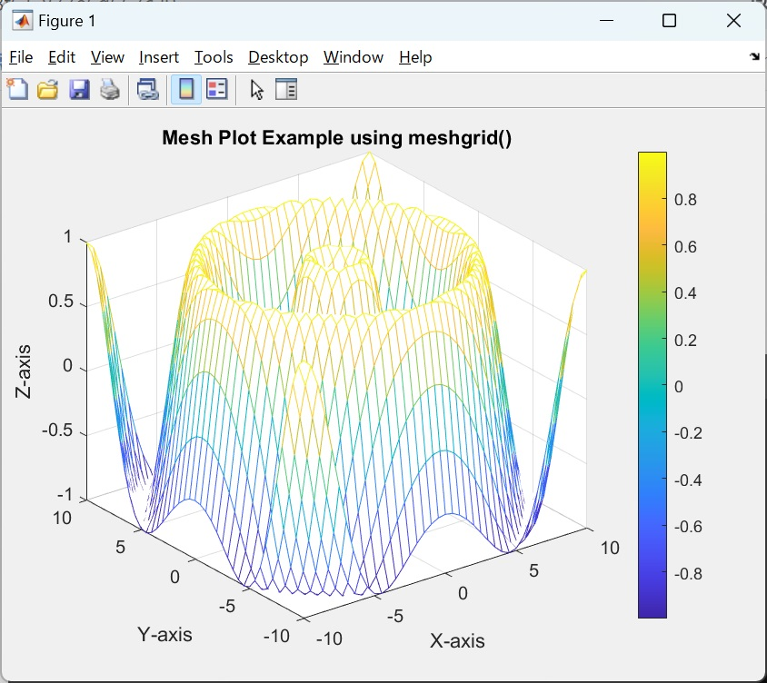
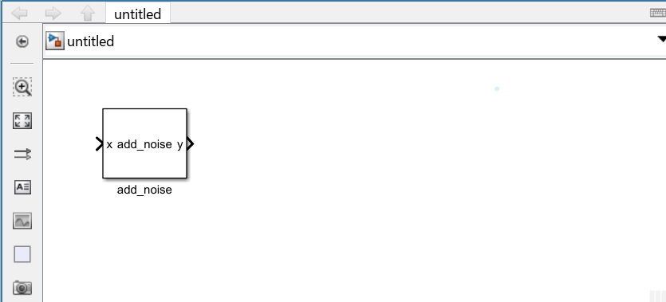

# ClipAndTry_MAT

When MATLAB function code generated by an LLM like ChatGPT is copied to the clipboard, it automatically runs.
If the first line is function(), it executes the function. If it is a MATLAB System class, it creates a Simulink block.

## MATLAB commands that download and open a demo program
~~~matlab
mkdir('./ClipAndTry_demo');
cd('./ClipAndTry_demo');
websave('ClipAndTry.m','https://raw.githubusercontent.com/covao/ClipAndTry_MAT/main/ClipAndTry.m');
websave('ClipAndTryDemo.m','https://raw.githubusercontent.com/covao/ClipAndTry_MAT/main/ClipAndTryDemo.m');
ClipAndTryDemo;
~~~

## Prompt Example 1: Create MATLAB function 
~~~
# Create the following MATLAB function
- Function name: plot_test
- Plot an example using meshgrid()
~~~

## ChatGPT4-o Results
~~~matlab
function plot_test()
    % Create a range of values for x and y
    [x, y] = meshgrid(-10:0.5:10, -10:0.5:10);

    % Define the z values as a function of x and y
    z = sin(sqrt(x.^2 + y.^2));

    % Create the mesh plot
    mesh(x, y, z);

    % Add labels and title
    xlabel('X-axis');
    ylabel('Y-axis');
    zlabel('Z-axis');
    title('Mesh Plot Example using meshgrid()');

    % Add a colorbar
    colorbar;
end
~~~

## Prompt Example 2: Create MATLAB system class for Simulink block
~~~
# Create the following class for MATLAB system block
- Class name:add_noise
- Input: Vector signal
- Output: Vector signal
- Parameter: Level of noise
- Processing: Add white noise to the input signal
~~~

## ChatGPT4-o Results
~~~matlab
classdef add_noise < matlab.System
    % add_noise Add white noise to input signal
    %
    % This system object adds white noise to the input signal.

    properties
        % Level of noise
        NoiseLevel = 0.1; % Default noise level
    end

    methods (Access = protected)
        function setupImpl(obj)
            % Perform one-time calculations, such as computing constants
        end

        function y = stepImpl(obj, x)
            % Add white noise to the input signal
            %
            % x - input vector signal
            % y - output vector signal with added noise

            noise = obj.NoiseLevel * randn(size(x));
            y = x + noise;
        end

        function resetImpl(obj)
            % Initialize / reset discrete-state properties
        end

        function validateInputsImpl(obj, x)
            % Validate inputs to the step method at initialization
            validateattributes(x, {'numeric'}, {'vector'}, '', 'x');
        end

        function validatePropertiesImpl(obj)
            % Validate related or interdependent property values
            validateattributes(obj.NoiseLevel, {'numeric'}, {'scalar', 'nonnegative'}, '', 'NoiseLevel');
        end
    end

    methods (Access = protected)
        function processTunedPropertiesImpl(obj)
            % Handle changed properties that require an update to the system object
        end

        function releaseImpl(obj)
            % Release resources, such as file handles
        end
    end

    methods (Access = protected, Static)
        function header = getHeaderImpl
            % Define header panel for System block dialog
            header = matlab.system.display.Header(mfilename('class'));
        end

        function group = getPropertyGroupsImpl
            % Define property section(s) for System block dialog
            group = matlab.system.display.Section(...
                'PropertyList', {'NoiseLevel'});
        end
    end
end
~~~

